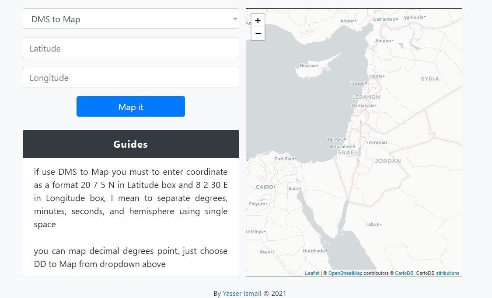

# Mapping of-Points which as Format DMS & DD
#### Let me first say that I always encountered coordinates in either decimal degrees(DD) format or degrees minute second(DSM) format and I always did be interested in locations it , so I decided that build a simple web app (or very simple 😅) to mapping coordinates as a fast, also there is another reason is I'm honestly too lazy to open ArcGIS to mapping coordinates(Does not deserve it)
 

 

## for use it [Mapping Coordinates](https://mappingofpoints.netlify.app)
**Yasser Ismail © 2021**
